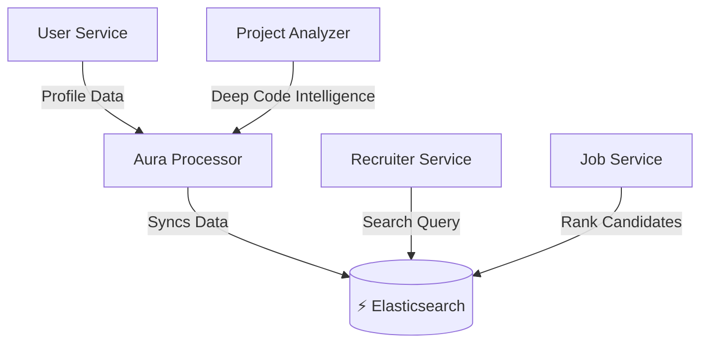

# 💎 Backend Premium Strategy: Monetizing the "Verify" Ecosystem

You have a powerful **Project Analyzer Engine** (24k lines of Go) that generates deep intelligence. Currently, this intelligence is under-utilized. By integrating **Elasticsearch** and creating a **Premium Logic Layer**, you can transform this from a "Profile Viewer" into a "High-Value Hiring Platform".

---

## 1. Architecture: The "Intelligence Mesh"

We need to connect your isolated services so that **Deep Data** flows into **Searchable Indices**.



### The Core Difference
*   **Current:** Recruiters search MongoDB (Standard text match).
*   **Premium:** Recruiters search Elasticsearch (Deep query on complexity, architecture, trust).

---

## 2. Premium Feature Catalog 💰

### 🏢 For Recruiters (B2B SaaS Model)
*Target: $299 - $899 / month*

| Feature | Description | Implementation Source |
| :--- | :--- | :--- |
| **Deep Code Search** | Search by "Clean Architecture", "Microservices", "High Complexity". | `project-analyzer` output in ES |
| **Trust Filters** | Filter out "Snapshot/Copied" code. "Show only `TrustScore > 80`". | `trust_analysis` from Go engine |
| **Verified Skill Match** | "Find React devs, but only if they have **Verified Usage** > 5 files". | `usage_verified` flag in ES |
| **"Ghost" Detection** | Flag candidates who list skills (e.g., Kubernetes) but have 0 lines of code for it. | `skill_gap_analysis` |
| **Tech Stack Clusters** | "Find me a **T3 Stack** developer" (Next.js + tRPC + Tailwind + TypeScript). | `detected_stacks` graph analysis |

### 👨‍💻 For Candidates (B2C Subscription)
*Target: $19 - $49 / month*

| Feature | Description | Implementation Source |
| :--- | :--- | :--- |
| **Search Boost** | Premium profiles get a `1.2x` score multiplier in Recruiter searches. | `function_score` query in ES |
| **Verified Badge** | "Verify Certified" badge on profile if `Aura > 500`. | `user-service` logic |
| **Resume Auto-Gen** | Generate a PDF resume based on *actual code*, not claims. | `project-analyzer` summary |
| **Who Viewed Me** | See exactly which companies viewed your code analysis. | `recruiter-service` access logs |

---

## 3. Implementation Roadmap

### Phase 1: The "Search Engine" Foundation (Week 1)
**Goal:** functionalities Get deep data from Go Engine into Elasticsearch.

1.  **Setup Elasticsearch Cloud:** Create `candidates` index.
2.  **Update `aura-processor`:**
    *   Consume `project.analyzed` event.
    *   Flatten the deep deep JSON (Architecture, Skills, Trust).
    *   Sync to Elasticsearch `candidates` index.
3.  **Backfill:** Run a script to index all existing users.

### Phase 2: Recruiter "Deep Search" API (Week 2)
**Goal:** Enable the "Impossible Queries".

1.  **Recruiter Service:** properties Add `GET /api/candidates/search`.
2.  **Query Logic:**
    ```json
    {
      "must": [
        { "term": { "skills.name": "React" } },
        { "term": { "skills.verified": true } },
        { "range": { "architecture_score": { "gte": 70 } } }
      ]
    }
    ```

### Phase 3: The "Monetization" Layer (Week 3)

1.  **Candidate Boosting:**
    *   Add `isPremium` boolean to `User` model.
    *   Update ES Sync to include `boost_factor: 1.2` for premium users.
2.  **Recruiter Tiers:**
    *   Free: Basic search (Name, Location, Keywords).
    *   Pro: Advanced Search (Architecture, Trust, Complexity).

### Phase 4: The "AI-Supercharged" Tier (Week 4+) 🤖
*Requires `ai-service` integration.*

**For Candidates ($49/mo - "Elite Dev"):**
1.  **AI Code Review:** Candidates can upload code snippets or link PRs. The `ai-service` analyzes them against industry best practices (Clean Code, SOLID) and suggests improvements.
2.  **Mock Interview Bot:** An AI agent that conducts technical interviews based on the *actual tech stack* found in their projects. "I see you used Redux Saga in Project X. Explain how you handled the race condition..."
3.  **Career Path Optimization:** "To jump from **Senior** to **Staff**, you need to demonstrate **System Design** skills. Here are 3 project ideas that fill that gap."

**For Recruiters ($899/mo - "Enterprise"):**
1.  **JD-to-Query Converter:** Recruiters paste a Job Description. AI converts it into the perfect Elasticsearch query (e.g., "Must have Go + gRPC + >4 years exp").
2.  **Candidate "Moneyball":** Identify **undervalued talent**. "This candidate has high Aura scores in Kubernetes but only lists a Junior title. Hire them before they realize their worth."
3.  **Smart Outreach Generator:** Generates personalized outreach emails citing specific projects. "I loved how you implemented the `rate-limiter` in your `go-proxy` repo..."

### Phase 5: "Ecosystem Features" (Long Term) 🌐

1.  **Mentorship Market:** Connect High-Aura Seniors with Juniors. The platform takes a 15% cut of mentorship fees.
2.  **Verified Hackathons:** Companies sponsor hackathons where code is auto-judged by your `project-analyzer` for quality, not just functionality.
3.  **Salary Insights:** "Candidates with Verified **Rust** skills in **Bangalore** are earning ₹45L avg." (Data accessible to Pro users).

### Phase 6: The "God Mode" Features (Unfair Advantage) ⚡
*Features no other platform has.*

1.  **"Onboarding Velocity" Prediction (Enterprise):**
    *   Companies link their own GitHub repo.
    *   We analyze *their* code style and compare it with the candidate's.
    *   **Result:** "This candidate writes Go exactly like your team. Estimated production-ready time: **3 Days** (vs avg 2 weeks)."

2.  **"Code DNA" Fingerprint:**
    *   Match candidates based on **Thinking Style**, not just keywords.
    *   "You need a **Functional Programmer** who loves **Immutability** and **Clean Architecture**. Here are the 3 candidates who match that DNA."

3.  **The "Silent Hero" Detector:**
    *   Most platforms rank "Feature Shippers" high.
    *   We verify **"Glue Work"**: Identify devs with high `RefactorCount` and `BugFixRatio`. These are the people who keep production stable.
    *   **Alert:** "High-Value Maintenance Engineer detected. Undervalued by the market."

4.  **"Proof of Work" Time-Lapse:**
    *   Recruiters don't have time to read code.
    *   **Feature:** A 30-second visual playback of how the project was built.
    *   "Watch them build: Auth System (Day 1) -> DB Schema (Day 2) -> API Optimization (Day 5)."
    *   **Benefit:** Instantly proves *organic* development vs *cloning*.

---

## 4. Elasticsearch-Powered Premium Features 🔍

### A. Real-Time Market Intelligence (Enterprise Tier)

**1. Live Talent Pool Analytics**
*   **Feature:** Real-time aggregations showing "How many Senior Go devs with Kubernetes are available in Bangalore RIGHT NOW?"
*   **ES Tech:** Aggregation pipelines + Date histograms
*   **Value:** Recruiters can see supply/demand in real-time before posting a JD.

**2. Skill Trending Dashboard**
*   **Feature:** "React Native popularity dropped 15% this month. Next.js is up 42%."
*   **ES Tech:** Time-series aggregations on skill frequencies
*   **Value:** Companies adjust hiring strategies based on market movement.

**3. Salary Benchmarking Engine**
*   **Feature:** "Verified Backend devs with Docker + AWS in your city earn ₹18-32L/yr (median: ₹24L)"
*   **ES Tech:** Percentile aggregations + Geo-queries
*   **Value:** Candidates know their worth. Recruiters set competitive offers.

### B. "Reverse Job Matching" (Game Changer)

**4. Percolate Queries - Save Searches, Auto-Match New Candidates**
*   **How it works:**
    *   Recruiter creates a job post with requirements.
    *   We convert it into an ES **Percolate Query** and save it.
    *   When a NEW candidate joins (or updates profile), we run their profile against ALL saved queries.
    *   **Result:** "You match 12 jobs! 3 are Enterprise companies."
*   **ES Tech:** Percolate queries (reverse search)
*   **Value:** Passive candidates get matched without applying. Recruiters get instant alerts.

**5. "Dream Job" Alerts for Candidates**
*   **Feature:** Candidate sets filters: "Remote + Rust + >₹30L + Seed Stage Startup"
*   **Implementation:** Save as a percolate query. Alert when matching job is posted.
*   **ES Tech:** Stored percolators + Real-time indexing
*   **Value:** No more manual job hunting. The platform does the work.

### C. Similarity Search & Recommendations

**6. "Find Developers Like This One"**
*   **Feature:** Recruiter finds a great candidate. Clicks "Find Similar".
*   **ES Query:** `more_like_this` on `skills`, `architecture_patterns`, `tech_stack_vector`
*   **Result:** "Here are 8 developers with similar profiles but 20% cheaper."
*   **Value:** Discover talent you didn't know existed.

**7. Code Pattern Similarity (Advanced)**
*   **Feature:** Match by **coding style**, not just tech stack.
*   **Implementation:** Extract code metrics (avg function length, cyclomatic complexity, comment density) → Store as vector → Use `dense_vector` similarity.
*   **ES Tech:** Vector search (requires ES 8.0+)
*   **Value:** "This candidate writes concise, well-documented code just like your team."

**8. Team Composition Recommender**
*   **Feature:** "You hired 3 Backend devs. Our data shows teams with this profile also hire 1 DevOps + 1 Frontend within 6 months."
*   **ES Tech:** Co-occurrence aggregations + ML inference
*   **Value:** Predictive hiring planning.

### D. Advanced Search UX (User Delight)

**9. Smart Autocomplete & Typo Tolerance**
*   **Feature:** User types "kubernets" → Suggests "Kubernetes"
*   **ES Tech:** Completion suggesters + Fuzzy matching
*   **Value:** Faster search, fewer "0 results" pages.

**10. Natural Language Search**
*   **Feature:** Recruiter types: "Senior developer who built microservices with high test coverage"
*   **Backend:** Parse using NLP → Convert to ES query
*   **ES Tech:** Multi-match + boosting + filters
*   **Value:** Non-technical recruiters can search like they talk.

**11. Faceted Search with Live Counts**
*   **Feature:** Left sidebar shows: "React (247), Vue (89), Angular (34)"
*   **ES Tech:** Terms aggregations
*   **Value:** Recruiters see distribution before filtering.

### E. Anomaly Detection & Quality Signals

**12. "Unicorn Developer" Detector**
*   **Feature:** Automatically flag outliers: "This candidate has 3x more production experience than peers at their level."
*   **ES Tech:** Percentile ranks + Statistical outliers
*   **Value:** Surface hidden gems.

**13. "Red Flag" Alerts**
*   **Feature:** "This profile claims 8 years of React experience but their oldest React project is from 2023."
*   **ES Tech:** Cross-field validation queries
*   **Value:** Prevent resume fraud.

**14. Consistency Score**
*   **Feature:** "GitHub shows 500 commits in Go, but resume lists 'Beginner Go'. Flag: Inconsistent."
*   **ES Tech:** Script fields comparing multiple sources
*   **Value:** Trust verification.

### F. Geo-Intelligence & Location Features

**15. Talent Density Heatmaps**
*   **Feature:** Interactive map: "450 Full-Stack devs in Bangalore, 230 in Pune."
*   **ES Tech:** Geo-aggregations + GeoJSON
*   **Value:** Companies decide where to open offices based on talent availability.

**16. Remote vs On-site Preference Trends**
*   **Feature:** "72% of Senior Backend devs prefer remote. Only 18% accept on-site."
*   **ES Tech:** Terms aggregations + Filters
*   **Value:** Adjust job posts to match market reality.

**17. Relocation Willingness Scoring**
*   **Feature:** "This candidate has applied to 8 remote jobs but 0 on-site. Relocation likelihood: LOW."
*   **ES Tech:** Behavioral signals from application history
*   **Value:** Don't waste time on candidates unlikely to accept.

### G. Time-Series & Growth Tracking

**18. Developer "Growth Trajectory"**
*   **Feature:** "Aura Score grew 40% in 6 months. Skills added: Kubernetes, Terraform."
*   **ES Tech:** Date histograms + Diff aggregations
*   **Value:** Hire fast learners, not just experienced folks.

**19. Market Shift Predictions**
*   **Feature:** "Based on 3-month trends, demand for Rust will spike in Q2."
*   **ES Tech:** Time-series analysis + Linear regression
*   **Value:** Plan hiring 2 quarters ahead.

**20. "Comeback Developer" Detection**
*   **Feature:** "This dev was inactive for 2 years but just shipped 3 projects. Likely motivated."
*   **ES Tech:** Activity gap analysis
*   **Value:** Discover re-entering talent (parents, career switchers).

### H. Collaborative & Social Features

**21. "Talent Pools" for Teams**
*   **Feature:** Recruiter creates a private pool: "Shortlisted Backend Devs for Q2 2026"
*   **ES Tech:** Filtered aliases + Access control
*   **Value:** Team collaboration on hiring.

**22. Competitive Intelligence**
*   **Feature:** "Your competitor just viewed 5 React devs in your target city."
*   **ES Tech:** Activity logs + Aggregations
*   **Value:** Stay ahead in talent war.

**23. Referral Quality Scoring**
*   **Feature:** "Candidates referred by Employee X have 80% hire rate. Boost referrals from them."
*   **ES Tech:** Join queries (candidate source + outcome)
*   **Value:** Optimize referral programs.

### I. Pricing & Subscription Intelligence

**24. Dynamic Pricing Based on Demand**
*   **Feature:** "You're searching for Go+AWS. High demand. Unlock 50 profiles for $X or 200 for $Y (20% off)."
*   **ES Tech:** Real-time aggregations on search patterns
*   **Value:** Revenue optimization.

**25. "Credit System" for Searches**
*   **Feature:** Free tier gets 10 searches/month. Each "Deep Search" costs 2 credits.
*   **ES Tech:** Query complexity scoring
*   **Value:** Monetize advanced features.

### J. Advanced Analytics for Candidates

**26. "Profile Strength Score"**
*   **Feature:** "Your profile is stronger than 78% of Backend devs. Add Docker to reach Top 10%."
*   **ES Tech:** Percentile ranks across all users
*   **Value:** Gamification drives profile completion.

**27. "Visibility Insights"**
*   **Feature:** "Your profile appeared in 23 searches this week. 12 were from Seed startups."
*   **ES Tech:** Reverse query logging
*   **Value:** Candidates see ROI of premium.

**28. Gap Analysis**
*   **Feature:** "You have React but no TypeScript. 85% of React jobs require TypeScript."
*   **ES Tech:** Co-occurrence analysis of job requirements
*   **Value:** Career guidance.

---

## 5. Technical Gap Analysis (What's Missing)

| Service | Missing Component | Action Required |
| :--- | :--- | :--- |
| **Job Service** | **Job Boosting** | Add `isFeatured` flag to `Job` model. |
| **User Service** | **Premium Flag** | Add `subscriptionTier` field. |
| **Recruiter Service** | **Search API** | Create the ES client wrapper. |
| **AI Service** | **Analysis Pipeline** | Create `analyze_snippet` and `generate_outreach` endpoints. |
| **Infrastructure** | **Event Bus** | Ensure `USER_FLAGS_UPDATED` event syncs to ES immediately. |

---

## 5. Summary
You have built a **Ferrari Engine** (`project-analyzer`), but you are currently parking it in a **Garage** (MongoDB).
**Elasticsearch** is the race track.

**Immediate Next Step:**
Start **Phase 1**: Configure Elasticsearch in `aura-processor` and sync the first "Deep User Profile".
