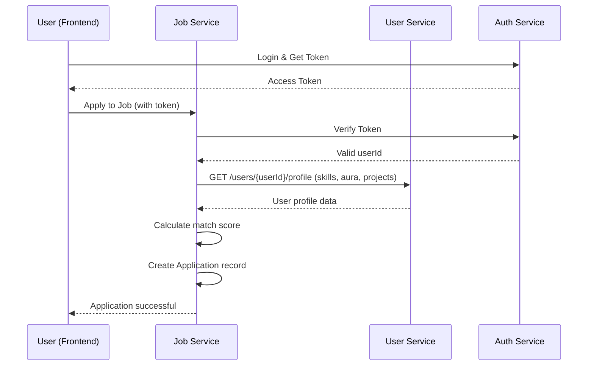
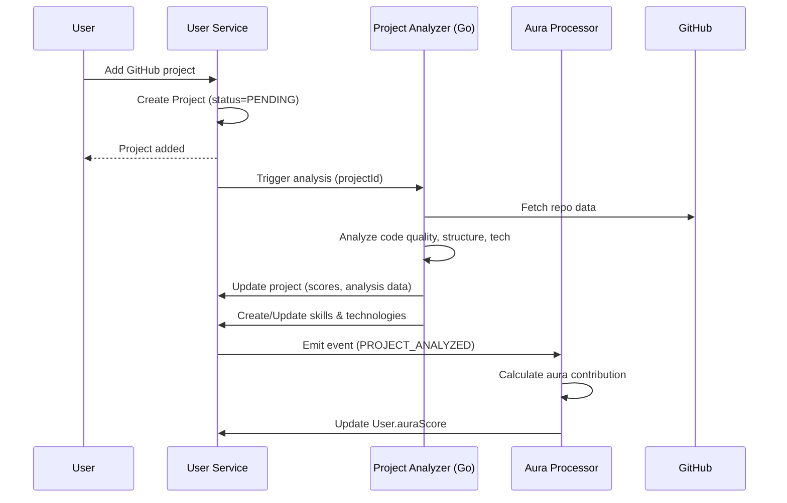

# 🏗️ Backend Schema Architecture & Data Flow

## 📊 Overview

Yeh document aapke pure backend ke **database schema architecture** aur **service-to-service data flow** ko explain karta hai.

---

## 🎯 Core Principles

### 1. **Microservices Architecture**
- Har service ki apni independent database hai (MongoDB)
- Services directly dusri service ke database ko access nahi karti
- Communication via APIs (inter-service calls)

### 2. **Data Denormalization Strategy**
- **Read-heavy data** ko denormalize karte hain for performance
- Common use case: Job listing me organization name store karna
- Trade-off: Slight data duplication vs faster queries

### 3. **Indexing Strategy**
- **Single-field indexes**: Frequently queried fields (userId, email, status)
- **Compound indexes**: Multi-field queries (userId + createdAt)
- **Sort indexes**: Listing queries with sorting (createdAt DESC)

---

## 🗄️ Service-wise Schema Breakdown

### 1️⃣ **AUTH SERVICE** (`auth-service`)
**Purpose**: Authentication, session management, basic user profile

#### Models:
```
User
├── Basic Info (githubId, username, email, name, avatar)
├── Aura Stats (auraScore, coreCount, githubFollowers)
├── Relations
│   ├── Session[] (1:N)
│   ├── Skill[]
│   ├── Project[]
│   ├── Experience[]
│   ├── SocialLink[]
│   └── Activity[]

Session
├── User reference (userId)
├── Refresh token (for JWT rotation)
├── Metadata (userAgent, ipAddress)
└── Expiry tracking
```

#### Key Indexes:
- `User`: githubId, username, email, auraScore, createdAt
- `Session`: userId, refreshToken, expiresAt, isValid

#### Data Flow:
```
GitHub OAuth → Create User → Generate Session → Return Access + Refresh Tokens
↓
Session Verification → Validate Token → Extend/Invalidate
```

---

### 2️⃣ **USER SERVICE** (`user-service`)
**Purpose**: Complete user profile, skills, projects, experiences

#### Models:
```
User (Extended Profile)
├── Student Info (collegeName, cgpa, branch, graduationYear)
├── Onboarding (onboardingComplete, onboardingStep)
├── Visibility Settings (showEmail, showCgpa)
├── Relations
│   ├── Skill[] (with SkillSource tracking)
│   ├── Technology[] (NEW - Infrastructure tech)
│   ├── Project[]
│   ├── Experience[]
│   └── Activity[]

Skill
├── User reference
├── Source (GITHUB | ANALYSIS | MANUAL)
├── Verification (isVerified, verifiedScore, evidence)
└── Stats (projectCount, linesOfCode, auraContribution)

Technology (NEW MODEL)
├── User reference
├── Category (INFRASTRUCTURE, CICD, MONITORING, CLOUD, SECURITY)
├── Detection Info (detectedFrom[], confidence)
└── Stats (projectCount, auraContribution)

Project
├── GitHub Info (repoUrl, stars, forks, language)
├── Analysis (status, analysisId, fullAnalysis)
├── Scores (codeQuality, structure, overall, aura)
└── Visibility (isPublic, isPinned, displayOrder)

Experience
├── Type (WORK | EDUCATION | CERTIFICATION | VOLUNTEER)
├── Details (title, organization, location, description)
├── Timeline (startDate, endDate, isCurrent)
└── Skills (string array)

Activity
├── Type (LOGIN, PROJECT_ADDED, SKILL_VERIFIED, etc.)
├── Points (auraPoints)
└── Reference (optional link to related entity)
```

#### Key Differences from Auth Service:
- **Student-specific fields** for college students
- **SkillSource enum** - Tracks WHERE skill came from
- **Technology model** - Separate from coding skills (DevOps, Cloud, etc.)
- **Evidence field** in Skill - JSON proof of verified skills

#### Key Indexes:
- `User`: All auth indexes + isStudent, onboardingComplete
- `Skill`: userId, source, category, isVerified, name
- `Technology`: userId, category, name
- `Project`: userId, analysisStatus, overallScore, createdAt
- `Activity`: userId, type, createdAt DESC (for feeds)

#### Data Flow:
```
User adds GitHub project
↓
Project saved with PENDING status
↓
[PROJECT-ANALYZER service analyzes code]
↓
Analysis complete → Update project scores
↓
Extract skills/tech → Create/Update Skill & Technology records
↓
Calculate aura contribution → Update User.auraScore
↓
Create Activity record (PROJECT_ANALYZED)
```

---

### 3️⃣ **JOB SERVICE** (`job-service`)
**Purpose**: Job postings, applications, skill matching

#### Models:
```
Job
├── Organization (organizationId, recruiterId, organizationName - DENORMALIZED)
├── Details (title, description, requirements, responsibilities)
├── Classification (jobType, experienceLevel, location, locationType)
├── Compensation (salaryMin, salaryMax, currency)
├── Requirements (minAuraScore, minCoreCount)
├── Status & Metrics (status, applicationsCount, viewsCount)
└── Relations
    ├── JobSkill[] (required skills for this job)
    └── Application[] (candidates who applied)

JobSkill
├── Job reference
├── Skill requirements (skillName, minScore, isRequired)
└── Differentiates must-have vs nice-to-have

Application
├── References (jobId, userId - from user-service)
├── Application Data (coverLetter, resumeUrl, resumeSnapshot)
├── Match Score (matchScore 0-100, matchBreakdown JSON)
├── Status (PENDING → REVIEWING → SHORTLISTED → INTERVIEW → OFFER)
└── Recruiter Feedback (notes, rating)
```

#### Key Indexes:
- `Job`: organizationId, recruiterId, status, jobType, experienceLevel, minAuraScore
- `Job` compound: [status + createdAt] for active job listings
- `JobSkill`: jobId, skillName, isRequired
- `Application`: jobId, userId, status, matchScore DESC, appliedAt DESC
- `Application` compound: [jobId + status], [userId + status]

#### Data Flow:
```
Recruiter creates job → Save Job + JobSkill records
↓
Candidate applies
↓
Fetch candidate data from USER-SERVICE (skills, aura, projects)
↓
Calculate match score (skill overlap with JobSkill requirements)
↓
Create Application with matchScore & matchBreakdown
↓
Recruiter reviews → Update Application.status
```

---

### 4️⃣ **RECRUITER SERVICE** (`recruiter-service`)
**Purpose**: Recruiter accounts, organizations, candidate management

#### Models:
```
Recruiter
├── Auth (email, passwordHash)
├── Profile (name, title, phone, avatarUrl)
├── Organization (organizationId, role)
├── Status (isActive, isVerified, emailVerified)
└── Relations
    ├── RecruiterSession[]
    ├── SavedCandidate[]
    └── CandidateFeedback[]

Organization
├── Basic Info (name, slug, logo, website, description)
├── Location (headquarters, country)
├── Details (industry, size, foundedYear, linkedIn)
├── Verification (isVerified, verifiedAt)
├── Stats (totalJobs, activeJobs - DENORMALIZED)
└── Relations
    └── Recruiter[]

SavedCandidate
├── References (recruiterId, candidateId - from user-service)
├── Recruiter Notes (notes, tags, rating)
└── Status (SAVED | CONTACTED | INTERESTED | NOT_FIT)

CandidateFeedback (NEW MODEL)
├── References (recruiterId, candidateId)
├── Feedback (message, status, rating)
├── Contact Info (contactEmail, contactPhone)
├── Job Context (optional jobId, jobTitle)
└── Category (JOB_OPPORTUNITY, INTERVIEW, NETWORKING, etc.)
```

#### Key Indexes:
- `Recruiter`: email, organizationId, isActive
- `RecruiterSession`: recruiterId, refreshToken, expiresAt
- `Organization`: slug, isVerified, industry
- `SavedCandidate`: recruiterId, candidateId, status, savedAt DESC
- `SavedCandidate` compound: [recruiterId + candidateId] unique
- `CandidateFeedback`: recruiterId, candidateId, status, createdAt DESC
- `CandidateFeedback` compound: [recruiterId + status]

#### Data Flow:
```
Recruiter searches candidates
↓
Fetch filtered users from USER-SERVICE API
↓
Recruiter saves candidate → Create SavedCandidate record
↓
Add notes/tags/rating → Update SavedCandidate
↓
Send feedback → Create CandidateFeedback record
↓
Candidate views feedback → Update status to READ
```

---

### 5️⃣ **AURA PROCESSOR** (`aura-processor`)
**Purpose**: Background aura score calculations

#### Models:
- **Same as auth-service** (read-only mirror of user data)
- **No write operations** except aura score updates

#### Data Flow:
```
Listen to events (Project analyzed, Skill verified, etc.)
↓
Fetch user data
↓
Calculate aura delta based on:
  - Project quality scores
  - Skill verification scores
  - GitHub stats (stars, forks, contributions)
  - Activity engagement
↓
Update User.auraScore
↓
Broadcast update to other services
```

---

## 🔄 Inter-Service Data Flow

### Example: User Applies to Job



### Example: Project Analysis Pipeline



---

## 🎯 Optimization Highlights

### ✅ What's Been Optimized:

1. **Consistent Field Annotations**
   - All `@db.ObjectId` properly annotated
   - Consistent `@map()` naming (snake_case in DB, camelCase in code)

2. **Complete Indexing Strategy**
   - Single-field indexes on all foreign keys
   - Compound indexes for common query patterns
   - Sort indexes for listing pages

3. **Performance Enhancements**
   - Denormalized frequently-accessed data (organizationName in Job)
   - Stats counters (applicationsCount, viewsCount)
   - Evidence JSON for skill verification (avoid extra joins)

4. **Data Integrity**
   - Unique constraints ([userId, name] for skills)
   - Cascade deletes (User deleted → Sessions, Skills, Projects deleted)
   - Proper relation definitions

5. **New Models Added**
   - **Technology** (user-service): Separate infra/DevOps tech tracking
   - **CandidateFeedback** (recruiter-service): Recruiter-to-candidate messaging

6. **Timestamp Tracking**
   - `updatedAt` added to ALL models (auto-updated)
   - Specific timestamps (analyzedAt, reviewedAt, readAt, etc.)

---

## 📋 Migration Checklist

### After Schema Changes, Run:

```bash
# Auth Service
cd auth-service
npx prisma generate
npx prisma db push

# User Service
cd user-service
npx prisma generate
npx prisma db push

# Job Service
cd job-service
npx prisma generate
npx prisma db push

# Recruiter Service
cd recruiter-service
npx prisma generate
npx prisma db push

# Aura Processor
cd aura-processor
npx prisma generate
npx prisma db push
```

### Testing Indexes:

```javascript
// MongoDB shell - Check indexes
db.users.getIndexes()
db.projects.getIndexes()
db.applications.getIndexes()
```

---

## 🚀 Next Steps

1. **Run migrations** for all services
2. **Update controllers/services** to use new Technology model
3. **Test query performance** with indexes
4. **Implement CandidateFeedback** endpoints in recruiter-service
5. **Add Technology detection** in project-analyzer

---

## 📞 Questions?

Koi doubt ho toh batao! Schema architecture aur data flow clear hai ab? 🎯
