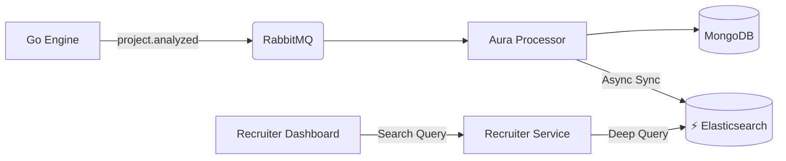

# 🚀 Elastic Search Strategy: Monetizing the "Project Analyzer" Engine

You have a powerful **24,000-line Go Engine** that generates "recruiter-grade" intelligence. Currently, this data likely sits in MongoDB (JSON) where it is hard to query deeply.

By connecting this engine to **Elasticsearch**, you unlock **"Deep Code Search"**—a feature that LinkedIn and generic hiring platforms *cannot* offer because they don't have your deep analysis engine.

---

## 1. Where to Integrate (Architecture)

**Do NOT change the Go Engine (`project-analyzer`).** It is perfect as a stateless compute unit.

Instead, hook into the **Output Phase**:



### The Data Flow
1.  **Go Engine** finishes analysis and drops the massive `ProjectSignals` JSON into RabbitMQ.
2.  **Aura Processor** (Node.js) picks it up.
3.  **Action:** While saving to MongoDB, it also **indexes a flattened version** of this data into Elasticsearch.

---

## 2. Killer Features (What You Can Build)

With your `ProjectSignals` structure, you can build these 5 "Impossible" features:

### 🔍 Feature A: "Architectural Search" (Premium)
Recruiters can usually only search for "React". With your engine + ES, they can search:
> *"Find me a **Lead Engineer** whose projects use **Microservices**, have **Events/Messaging (Kafka/RabbitMQ)**, and follow **Clean Architecture**."*

*   **How:** Query `technology_clusters`, `architecture_type`, and `advanced_patterns` fields from your engine.

### 🛡️ Feature B: "Trust-Based Filtering"
Filter out "tutorial watchers" and "copy-pasters".
> *"Show me React developers, but **exclude** anyone with `authorship_level = SNAPSHOT` or `trust_score < 70`."*

*   **How:** Use `git_forensics` and `trust_analysis` fields.

### 📈 Feature C: "Proven Experience" (Not just claimed)
> *"Find candidates who have actually **written verified code** in **Go** with **High Complexity** (> 40 score)."*

*   **How:** Query `verified_skills` where `usage_verified = true` and `complexity_score > 40`.

### 🧠 Feature D: "Stack-Specific Hiring"
> *"I need a MERN stack dev, but specifically one who uses **Redux** (not Context) and **Docker**."*

*   **How:** Your Graph Engine already outputs `DetectedStacks` and specifically detailed component usage (e.g., `react_signals.state_management`). ES makes this searchable.

### ⚡ Feature E: "Instant Talent Pipelines"
Recruiters can save complex queries as "Pipelines".
*   *Example:* "Alert me when a 'Senior' level 'Rust' developer with 'Production Readiness > 80' is analyzed."

---

## 3. Revenue Models (Making Money) 💰

### 💎 Model 1: "Verify Pro" for Recruiters ($299/mo)
*   **Free Plan:** Search by Job Title & Location (Standard DB search).
*   **Pro Plan:**
    *   **Filter by Code Quality:** "Only show me devs with `CodeQuality > 80`".
    *   **Filter by Architecture:** "Must have used `Docker` + `Kubernetes`".
    *   **Verify Badge:** See exactly *why* a skill is verified (Evidence trail).

### 🎫 Model 2: "Priority Indexing" for Candidates ($19/mo)
*   Candidates pay to have their profile **"Boosted"** in search results.
*   In Elasticsearch, you use a `function_score` query to multiply their relevance score by `1.2` (20% boost) if `is_premium = true`.

### 🔌 Model 3: API Licensing (Enterprise)
*   Sell your "Deep Analysis API" to other hiring platforms (e.g., "Powered by VerifyDev").
*   They send you a GitHub Repo → You send back the `IntelligenceVerdict` + ES Indexable JSON.

---

## 4. Technical Implementation Strategy

### Step 1: Define the ES Index Mapping
You need to flatten your complex Go struct into an ES-friendly format.

**`candidates` Index Schema:**
```json
{
  "mappings": {
    "properties": {
      "user_id": { "type": "keyword" },
      "full_name": { "type": "text" },
      "chapter_1_skills": { 
        "type": "nested",
        "properties": {
            "name": { "type": "keyword" },
            "confidence": { "type": "float" },
            "verified": { "type": "boolean" },
            "usage_verified": { "type": "boolean" }
        }
      },
      "architecture": {
        "properties": {
            "type": { "type": "keyword" },       // "microservices"
            "score": { "type": "float" },        // 85.5
            "patterns": { "type": "keyword" }    // ["cqrs", "event_driven"]
        }
      },
      "quality_metrics": {
        "properties": {
            "maintainability": { "type": "float" },
            "reliability": { "type": "float" }
        }
      },
      "trust_score": { "type": "integer" }       // 0-100
    }
  }
}
```

### Step 2: The "Sync" Function (in Node.js)
In `aura-processor`, specifically in the `project.analyzed` consumer:

```typescript
// On receiving ProjectSignals from RabbitMQ
async function handleProjectAnalyzed(msg) {
    const signals = JSON.parse(msg.content);

    // 1. Save deep data to MongoDB (for detailed view)
    await Mongo.save(signals);

    // 2. Transform for Search (Flattening)
    const esDoc = {
        user_id: signals.userId,
        skills: signals.industryAnalysis.verifiedSkills.map(s => ({
            name: s.name,
            confidence: s.confidence,
            verified: s.usageVerified
        })),
        architecture_type: signals.techDependencyGraph.detectedStacks,
        complexity_score: signals.complexity.totalScore,
        trust_score: signals.trustAnalysis ? signals.trustAnalysis.score : 0,
        // ... mapped fields
    };

    // 3. Push to Elastic
    await esClient.index({
        index: 'candidates',
        id: signals.userId,
        body: esDoc
    });
}
```

### Step 3: Result Ranking Algorithm
Your core advantage is **Ranking**. Instead of sorting by "Date Created", sort by **"Matches + Quality"**.

**ES Query Logic:**
"Rank candidates higher if:"
1.  Skill matches (Base score)
2.  `trust_score` is High (Function score * 1.5)
3.  `usage_verified` is True (Function score * 1.2)
4.  `complexity_score` matches the job expectation.

---

## Summary
You have a Ferrari (`project-analyzer` Go engine) currently driving in a school zone (MongoDB).
**Elasticsearch** is the Autobahn that lets you sell the speed and power of that engine to recruiters.

**Recommendation:** Start by indexing the **Verified Skills** and **Architecture Type** immediately. This gives you the "Search by Stack" feature which is the easiest to sell.
