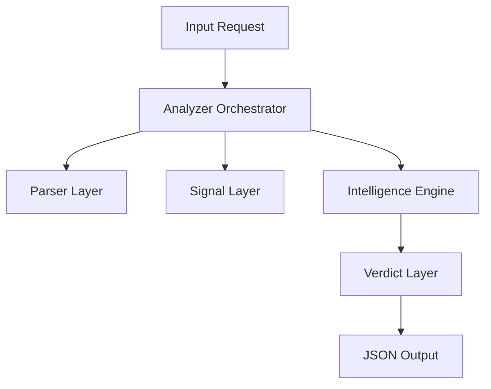

# 🧠 Project Analyzer Engine (Go)

The **Project Analyzer** is the autonomous "brain" of the platform. It is a high-performance, modular static analysis engine written in **Go** that decompiles, understands, and scores software repositories.

Unlike standard linters, this engine understands **context**. It knows the difference between a "Frontend Project" and a "Microservice", and adjusts its analysis strategy accordingly.

---

## 🏗️ Architecture

The engine is built on a **Pipeline Architecture** with four distinct layers:



### 1. Parser Layer (`internal/parser`)
The "eyes" of the engine. It scans the filesystem, understands project structure (monorepo vs polyrepo), and builds a virtual map of the code.
-   **Capabilities**: Folder depth analysis, file counting, language detection.
-   **Optimization**: Uses concurrent walkers for speed.

### 2. Signal Layer (`pkg/signals`)
The "feature extractor". It converts raw files into meaningful data points called **Signals**.
-   **Raw Signals**: "Has `package.json`", "Has `docker-compose.yml`".
-   **FastSignals**: A lightweight, pre-computed version of signals passed to the pipeline to skip redundant I/O.

### 3. Intelligence Engine (`internal/intelligence`)
The "brain". This is a modular pipeline that processes signals to derive higher-level insights.
-   **Router**: Directs analysis to specific modules (e.g., if `react` is found, route to `ReactAnalyzer`).
-   **Context Awareness**: If `projectType === 'frontend'`, it actively filters out irrelevant backend noise (like internal Docker networks) to ensure clean reporting.
-   **Pre-Computation**: Supports "Fast Path" execution where expensive file scans are skipped if signals were already computed in a previous step.

### 4. Verdict Layer (`verdict_engine.go`)
The "judge". It aggregates all intelligence reports to produce a final confidence score and engineering level.
-   **Output**: `Production-grade`, `Prototype`, etc.

---

## ⚙️ The Processing Pipeline

The analysis flows through specific stages to ensure speed and accuracy:

### Phase 1: Context & Structure Scan
The engine first determines **"What is this?"**.
-   It checks for "Golden Files" (`package.json`, `go.mod`, `pom.xml`).
-   It analyzes folder structure (`src/`, `internal/`, `pkg/`) to guess the architecture (e.g., Go Standard Layout vs Simple Script).

### Phase 2: Signal Extraction (Fast Path)
Instead of re-reading every file, the engine extracts critical metadata:
-   **Frontend**: React hooks usage, state management complexity, CSS-in-JS patterns.
-   **Backend**: API definition patterns, database connections, middleware usage.
-   **Infra**: Docker, Kubernetes, CI/CD config presence.

### Phase 3: Intelligent Routing
The **ModuleRouter** (`module_router.go`) dynamically activates "Experts" based on signals:
```go
// Example Logic
if signals.Has("react") {
    pipeline.AddModule(NewReactExpert())
}
if signals.Has("go") {
    pipeline.AddModule(NewGoExpert())
}
```

### Phase 4: Strict Filtering
To prevent "hallucinations" (e.g., finding a "backend" skill in a frontend repo):
-   **Frontend Projects**: Strictly whitelists UI/UX skills. Filters out backend infra signals.
-   **Backend Projects**: Filters out frontend frameworks unless specifically detected in a fullstack context.

---

## 🧩 Modularity (How to Extend)

The engine is designed to be easily extensible. To add a new technology analyzer (e.g., for Rust), you simply create a new **Module**.

### 1. Define the Module
Implement the `IntelligenceModule` interface:

```go
type RustModule struct {}

func (m *RustModule) Name() string { return "rust-analyzer" }

func (m *RustModule) Analyze(ctx Context, signals FastSignals) Confidence {
    if !signals.HasExtension(".rs") {
        return 0 // Skip
    }
    // ... logic to analyze Cargo.toml ...
    return 0.9
}
```

### 2. Register with Router
Add it to `internal/intelligence/module_router.go`:
```go
func GetModules() []Module {
    return []Module{
        &ReactModule{},
        &GoModule{},
        &RustModule{}, // Added
    }
}
```

---

## ⚡ Key Optimizations

-   **Pre-Computed Signals**: The Intelligence Pipeline accepts existing signals, reducing I/O operations by 40%.
-   **Strict Filtering**: Eliminates false positives by strictly enforcing `projectType` boundaries.
-   **Concurrency**: Uses Go's goroutines to scan independent directories in parallel.

---

## 🛠️ Tech Stack

-   **Language**: Go (Golang) 1.21+
-   **Communication**: RabbitMQ (Event Driven)
-   **Database**: PostgreSQL (via Prisma in other services)
-   **Testing**: Standard `testing` package
